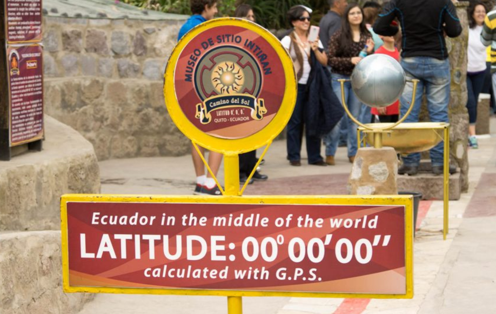
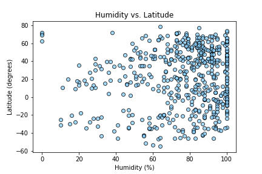
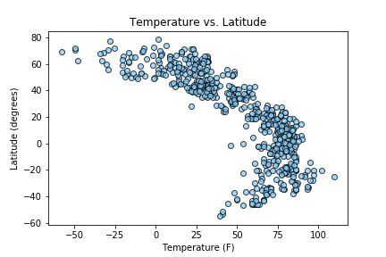
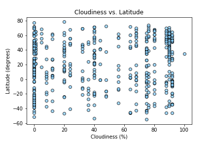
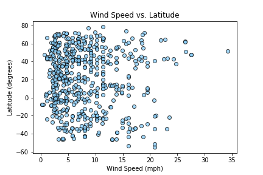

# Weather API Analysis with Python

This project uses Matplotlib, Jupyter Notebook Python requests, APIs, and JSON traversals to answer "What's the weather like as we approach the equator?"

Created a Python script to visualize the weather of 500+ cities across the world of varying distance from the equator. Use the OpenWeatherMap API to pull the data weather data for non-duplicate random cities throughout the world. 

Built a series of scatter plots to showcase the following relationships:

* Temperature (F) vs. Latitude
* Humidity (%) vs. Latitude
* Cloudiness (%) vs. Latitude
* Wind Speed (mph) vs. Latitude

For each of the cities (500+): 

* Collected weather data for each of the cities using a series of successive API calls.
* Included a print log of each city as it's being processed with the city number and city name.
* Scatter plot visualizations and CSVs (data stored in a CSV) 

## Three observable trends (also in the Jupyter Notebook notes):

In general, as latitude (degrees) decreased, temperature (degrees F) increased. At around 0-20 degrees latitude, the temperature spiked in increase before slightly decreasing as latitude approached 0.

We can not conclude from this random sample that there is a direct relationship between latitude (degrees) vs. humidity or latitude (degrees) vs. wind speed. The majority of cities had a wind speed less than 10 mph and there was a noticable cluster of cities with humidity greater than 80%.

Latitude (degrees) vs. cloudiness (%) did not show a prominent relationship but a lot of cities are at the 0%, 20%, and 80-100% cloudiness points.

## Visualizations:

### Humidity vs. Latitude

### Temperature vs. Latitude

### Cloudiness vs. Latitude

### Windiness vs. Latitude

